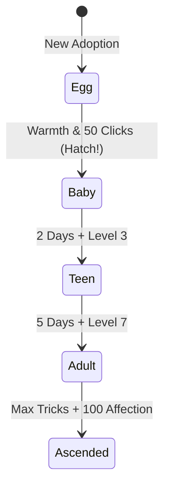

# Feature Spec: Lifecycle, Aging & Evolution 🥚➔🐾➔👑

## Overview
Adds a rich lifecycle progression where your companion begins as a mysterious egg, hatches into a baby needing nurturing, grows into an energetic teen, and evolves into a distinct adult.

## Lifecycle Stages



### 1. Egg Stage
- **Visual**: Wobbling, speckled egg with warm glowing cracks as it nears hatching.
- **Interactions**: Tap to warm the egg; gentle chimes sound when tapped.
- **Hatching Ceremony**: Crack animation with sparkling burst and first baby squeaks.

### 2. Baby Stage
- **Visual**: Chibi proportions, oversized eyes, wobbly steps.
- **Care**: Frequent feedings required, short energy bar, frequent adorable naps.
- **Voice**: High-pitched baby chirps.

### 3. Teen Stage
- **Visual**: Sleek, energetic form, perky ears, active tail wags.
- **Care**: Learns tricks with double XP bonus; has occasional "rebellious" moments (playful refusal with a cheeky tongue emote).
- **Voice**: Bright, lively chirps.

### 4. Adult Stage
- **Visual**: Full-grown proportions, majestic tail/horns/wings, unlocks all accessories.
- **Care**: Autonomous habits (tidies desktop, initiates games, deep affection).

## Data Model Extensions
```dart
enum LifeStage { egg, baby, teen, adult, ascended }

class LifeCycleState {
  DateTime birthDate;
  int daysAlive;
  LifeStage currentStage;
  int warmthClicks; // For egg stage
  int totalNaps;
  int totalTreatsEaten;
}
```
